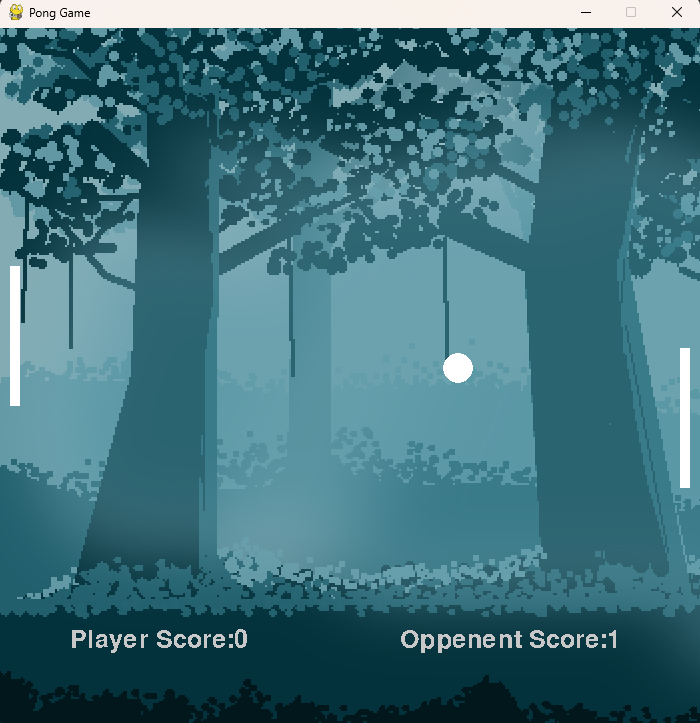

# Pong Game in Python

This is a simple implementation of the classic Pong game built using Python and the Pygame module. It includes two paddles, a ball, and basic collision detection. I did this when I was in my 12th grade.

## Features
- **Single-player mode**: Each player controls one paddle.
- **Simple AI mode**: The opponent is played by the computer.
- **Score Tracking**: Keeps track of player scores.

## Screenshots


## Requirements
- Python 3.x
- Pygame module

## Installation

1. Clone this repository:
   ```bash
   git clone https://github.com/Adhish-Krishna/Pong-Game.git
   ```

2. Navigate to the project directory:
   ```bash
   cd Pong-Game
   ```

3. Install the Pygame module if you haven't already:
   ```bash
   pip install pygame
   ```

## How to Play

1. Run the game:
   ```bash
   python "Pong Game.py"
   ```

2. **Controls**:
   - Use `UP` and `DOWN` arrows to control.

## Future Enhancements
- Add power-ups for extra gameplay dynamics.
- Improve AI for more challenging gameplay.
- Add sounds and music.
